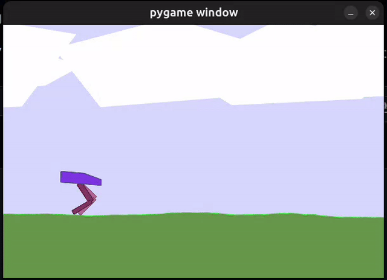

# Soft Actor-Critic (SAC) Implementation

This repository contains an implementation of the Soft Actor-Critic (SAC) algorithm using PyTorch. It provides a flexible framework for continuous control tasks in reinforcement learning, featuring hyperparameter tuning, robust logging, and support for various environments.

## Overview

This project details a modular and extensible implementation of the Soft Actor-Critic (SAC) algorithm in PyTorch, structured to facilitate research and experimentation in continuous control reinforcement learning. It emphasizes a clear separation of concerns, allowing for easy integration of diverse environments and flexible hyperparameter management, ensuring the agent's adaptability across various complex tasks.

### Tested Environments:
- **Gymnasium:**
  - `BipedalWalker-v3`

    
  - `InvertedPendulum-v5`
- **DonkeyCar:**
  - Includes a wrapper for the [DonkeyCar simulator](https://docs.donkeycar.com/guide/deep_learning/simulator/) v18.9, allowing the agent to be trained in a simulated car racing environment.

    
    
  - This environment utilizes a Variational Auto-Encoder (VAE) as a feature extractor. The VAE compresses high-dimensional image observations into a lower-dimensional latent space that the SAC agent can effectively use for decision-making.
  - The VAE implementation, simulator wrapper, and communication code are adapted from [Learning to Drive Smoothly in Minutes](https://github.com/araffin/learning-to-drive-in-5-minutes).

- **Custom Gym Environments:**
  - `OneDPointMassReachEnv`: A simple 1D point mass environment.
  - `QuadraticActionRewardEnv`: An environment with a quadratic penalty on actions.
  - `RandomObsBinaryRewardEnv`: An environment with random observations and binary rewards.
  - `ConstantRewardEnv`: An environment that returns a constant reward, useful for debugging.

## Key Features

- **Soft Actor-Critic (SAC) Algorithm:** A full implementation of the SAC algorithm, including the twin Q-network architecture and the automated entropy tuning.
- **Hyperparameter Tuning with Optuna:** The repository includes a script for hyperparameter optimization using [Optuna](https://optuna.org/). The search space can be easily configured using YAML files.
- **Logging System:** The logging system uses [TensorBoard](https://www.tensorflow.org/tensorboard) to log metrics, hyperparameters, and experiment results. It also saves Matplotlib graphs of the episode rewards, lengths, and Q-values.
- **Configuration via YAML Files:** All the hyperparameters for the agent and the training process can be easily configured using YAML files.
- **Jupyter Notebooks for Experimentation:** The repository includes several Jupyter notebooks that demonstrate how to use the SAC agent in different environments.
- **Custom Environments:** The project includes several custom environments that can be used to test and debug the agent.

## Installation

### 1. Clone the repository
```bash
git clone https://github.com/ignaschuemer7/RL-SAC.git
cd RL-SAC
```

### 2. Create a virtual environment
It is recommended to use a virtual environment to manage the dependencies.

```bash
python -m venv sac_env
source sac_env/bin/activate
```

### 3. Install the dependencies
```bash
pip install -r requirements.txt
```

## How to Run

### Training the Agent
You can train the SAC agent by running the `main.py` script with a configuration file. You can use the example configuration file `configs/example_config_env.yaml` as a starting point.

```bash
python main.py --config configs/example_config_env.yaml
```

To train on a different environment, you can create a new YAML configuration file and specify the environment name and other hyperparameters.

### Hyperparameter Search
The repository includes a script for hyperparameter optimization using Optuna. You can run the hyperparameter search by running the `hparam_search/scripts/run_search.py` script.

```bash
python hparam_search/scripts/run_search.py --search-config hparam_search/configs/search_space.yaml --base-config hparam_search/configs/base_hparams.yaml --n-trials 10 --study-name my-study
```

The search space and base hyperparameters can be configured in the `hparam_search/configs/search_space.yaml` and `hparam_search/configs/base_hparams.yaml` files, respectively.

### Jupyter Notebooks
The repository includes several Jupyter notebooks that demonstrate how to use the SAC agent in different environments. You can run the notebooks to see how the agent performs in each environment.

Navigate to the `notebooks` directory and open one of the notebooks.

### Viewing Logs
All experiment logs are saved in specific directories, organized by their purpose. You can view these logs using TensorBoard.

*   **`runs/`**: Contains logs for training runs executed directly via `main.py`.
*   **`hparam_search/hparam_runs/`**: Stores logs and results from hyperparameter optimization experiments conducted with Optuna.
*   **`notebooks/runs/`**: Holds logs tracking the progress of agents trained within the provided Jupyter notebooks.

To view the logs, navigate to the project root and run TensorBoard, specifying the relevant directory:

```bash
tensorboard --logdir runs/
# Or for hyperparameter search logs:
tensorboard --logdir hparam_search/hparam_runs/
# Or for notebook-specific logs:
tensorboard --logdir notebooks/runs/
```
This will start a TensorBoard server, and you can view the logs in your browser at `http://localhost:6006/`.


## Authors

This project was developed as the final project for the **Reinforcement Learning (I404)** course at [Universidad de San Andrés](https://www.udesa.edu.ar/), Argentina, by:

- **Fausto Pettinari** (fpettinari@udesa.edu.ar)  
- **Ignacio Schuemer** (ischuemer@udesa.edu.ar)
- **Santiago Tomas Torres** (storres@udesa.edu.ar)
